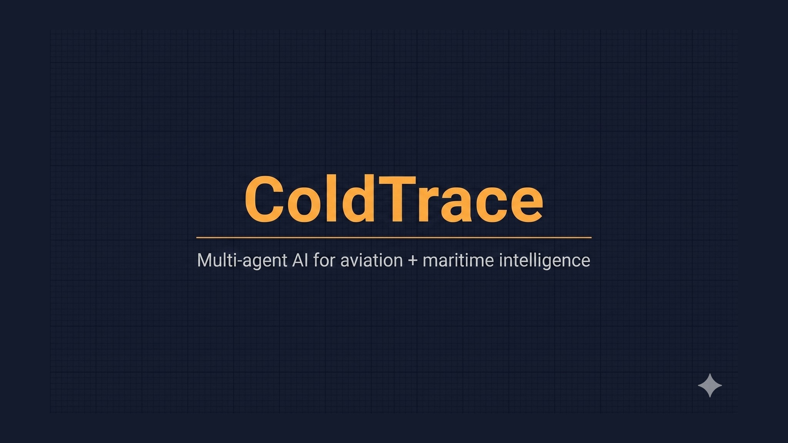

[Get started](getting-started){: .btn .btn-primary .fs-5 .mb-4 .mb-md-0 }

---

ColdTrace is an AI investigator for aviation and maritime intelligence questions. Type a question in plain English; specialist agents fan out across aircraft tracking feeds, vessel tracking feeds, sanctions records, and ownership records — in parallel — and write back a structured report.

This site is the user documentation.

## What's here

- **[Getting started](getting-started)** — first-time tour. The four tabs, your first investigation, and a glossary of the terms you'll see.
- **[Things to ask](example-queries)** — copy-paste queries grouped by intent.
- **[How it works](how-it-works)** — plain-English walkthrough of what happens between your question and the answer.
- **[Reading the map and the report](reading-results)** — what every symbol and section means.
- **[Live mode](live-mode)** — real-time aircraft + vessel monitoring, watch lists, and the click-to-investigate handoff.

## Demo videos

Three short demos showing what ColdTrace does end-to-end:

- **Multi-turn aviation investigation** over Japan (initial scan + refinement follow-up).
- **Live monitoring** over the Gulf of Mexico.
- **Cross-domain investigation** over Singapore Strait — live density, then a multi-agent investigation against historical data spanning air, sea, and sanctions.

Available on the [ColdTrace YouTube channel](https://www.youtube.com/@ColdTrace-ai).

## Contact

For inquiries: <cchdroid@gmail.com>.
