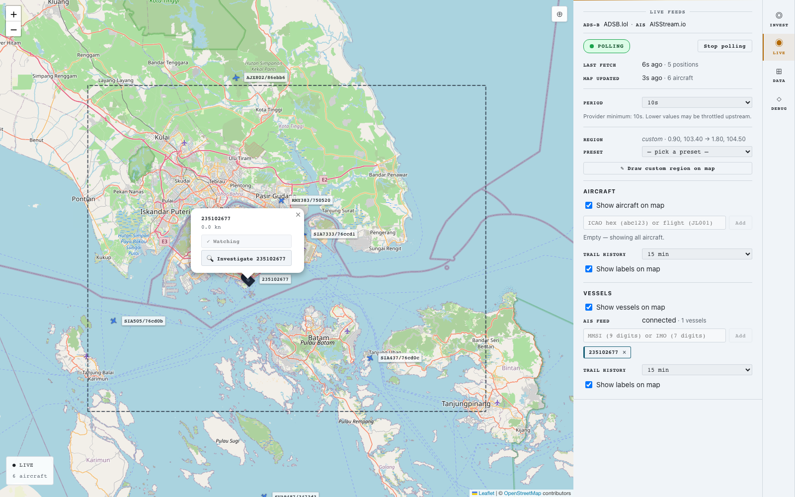

# Live mode

What the **LIVE** tab does, when to use it, and how to flip from a live target into a historical investigation.

---

## What LIVE is for

LIVE is a real-time map. Aircraft and vessel positions stream in as fast as the upstream feeds allow — typically every 10 seconds. You can pick a region, watch traffic move across it, follow specific aircraft or vessels with trails, and click any of them to flip into an investigation.

Use LIVE when something is *happening right now*:

- An active incident in a specific area.
- A flight you want to follow across multiple hours.
- A vessel approaching a port you care about.
- A general "what's flying / sailing here right now?" tour of an area.

Use **INVEST** (not LIVE) for *historical* questions ("what happened during last week's port visit?"). The agents that drive investigations work against historical data. LIVE is just the real-time view.

---

## The layout

Switching to the LIVE tab gives you a full-screen map with a side panel on the right.

The side panel has the controls; the map shows the data.

### Side panel — what each section does

**LIVE feeds** at the top tells you which data sources are connected — typically ADSB.lol for aircraft and AISStream.io for vessels.

**Polling status** — a green "POLLING" pill when the system is actively fetching, plus a Start/Stop button. Polling is off by default; flip it on when you want live updates. Below, you see how long ago the last fetch was and how many positions came back.

**Period** — how often the system asks the upstream feed for new data. 10 seconds is the minimum (any faster gets throttled). You can drop to 15s or 30s if you don't need second-by-second updates.

**Region** — controls the geographic area being polled. Two ways to set it:

- *Preset* dropdown — pick from named regions (Singapore, Japan, Gulf of Mexico, US East, etc.).
- *Draw custom region on map* — click + drag a rectangle on the map; the bounding box becomes the active region. Apply or Cancel from the side panel.

**Aircraft** section — toggle aircraft visibility, manage the aircraft watch list, set trail history length, toggle map labels.

**Vessels** section — same shape, for vessels.

### Watch list

The watch list is what lets you follow a specific aircraft or vessel without losing it in the noise. Watched entities render with:

- A **larger marker** (24×30 px for vessels, 24×24 px for aircraft — bigger than the standard 16–18 px).
- A **coloured trail** showing where the entity has been in the last *N* minutes (configurable in "Trail history").
- Their **label** rendered prominently (when labels are enabled).

To add to the watch list:

- **By identifier** — type into the watch-list input. For aircraft: ICAO hex (`abc123`) or flight callsign (`JL001`). For vessels: MMSI (9 digits) or IMO (7 digits).
- **By click** — click any aircraft or vessel marker on the map; the popup includes a *"+ Add `<token>` to watch list"* button.

To remove, click the **×** on the chip in the watch list.

The watch list is persisted across sessions in your browser, so coming back to LIVE next time keeps your watched entities.

### Trails

When an entity is on the watch list, ColdTrace draws a polyline from its position history — every position fetched in the trail-history window. The trail grows in real time as new positions come in.

Trail history is configurable per-domain:

- **Aircraft trails**: 5, 15, 30, or 60 minutes.
- **Vessel trails**: 5, 15, 30, or 60 minutes.

Longer trails are useful for slow-moving vessels in a small bbox; shorter trails keep the map readable when many entities are moving fast.

When you remove an entity from the watch list, its trail clears.

### Map labels

By default, watched entities get a permanent label next to their marker (the callsign for aircraft, the name/MMSI for vessels). Unwatched entities only show their label on hover.

You can toggle permanent labels off for aircraft, vessels, or both — useful for a clean "trail showcase" view where the polylines are the star.

---

## The click flow

Click any marker on the map. A popup appears with two actions:

| Action | What it does |
|---|---|
| **+ Add `<token>` to watch list** | Adds the entity to the watch list. Same as typing the identifier into the watch input. If the entity is already watched, this button is disabled. |
| **🔍 Investigate `<token>`** | Flips into the **INVEST** tab with the composer pre-filled with a 90-day cross-domain investigation question about this entity. |

The **🔍 Investigate** button is the LIVE → INVEST handoff. It's how you go from *"I'm watching this thing right now"* to *"what's its history?"* without having to type a question manually.

The pre-filled question looks like:

- For an aircraft: *"Investigate aircraft `<token>` — flights over the last 90 days and any vessels that came close."*
- For a vessel: *"Investigate vessel `<token>` — port visits, sanctions history, and aircraft proximity over the last 90 days."*

You can send the pre-filled question as-is, or edit it before sending. A common workflow:

1. Watch a vessel on LIVE for a minute or two.
2. Click it → click 🔍 Investigate.
3. See the pre-filled per-vessel question; decide it's too narrow.
4. Edit the question into a regional scan (*"Show me sanctioned vessel activity in this strait over the last 90 days, and any aircraft that came close."*).
5. Send.

For more on what the pre-filled question buys you, see [example-queries.md](example-queries.md#live--investigate-handoff).

---

## What you'll see — coverage caveats

Both feeds depend on community-operated receivers. Coverage isn't uniform across the globe:

**Aircraft (ADS-B)** — generally good coverage globally. Densest over North America, Europe, East Asia, Australia, Brazil. Some gaps over oceans, central Africa, central Asia. Even busy regions can have brief "no aircraft visible" moments if no receiver in range is reporting at that instant.

**Vessels (AIS)** — coverage on the free AISStream tier is uneven. Dense in the Gulf of Mexico, North Sea, Mediterranean, Singapore Strait. Sparse-to-empty in the Persian Gulf, parts of West Africa, the Indian Ocean interior. If you set a Persian Gulf bbox and see zero vessels, that's usually receiver coverage, not an absence of ships.

When a region has weak coverage, you may see the aircraft layer populated but the vessel layer empty (or vice versa). The polling status pill stays green either way — the system is fetching; the upstream just doesn't have data for that box right now.

---

## Tips

**Pick the right region size.** A continent-scale bbox (Japan, East Asia) is great for ambient situational awareness but renders dozens or hundreds of entities — the map gets busy. A strait-scale bbox (Singapore, Gulf of Mexico straits) shows ~10–30 entities and is easier to track individual targets in. Use the right zoom for the task.

**Trail history is per-entity.** You set "30 minutes" globally, but each watched entity's trail is its own — adding a new entity to the watch list starts its trail fresh at that moment, not 30 minutes ago.

**LIVE polling can run while you investigate.** Switching to INVEST doesn't stop LIVE polling — it keeps running in the background. The state survives the tab switch. Switch back to LIVE and the map is where you left it.

**Pause polling when you don't need it.** Each poll is an upstream API call. If you're going to be away from the screen for a while, hit **Stop polling** in the side panel. The free tiers of both feeds have rate limits; polite consumption helps.

**Custom regions are persisted.** If you draw a custom bbox, it's saved to your browser. Coming back, the system will offer to restore it — useful when you've found a sweet-spot framing.

---

## What's next

- [getting-started.md](getting-started.md) — first-time tour of the whole app.
- [example-queries.md](example-queries.md) — questions to ask once you've flipped into INVEST.
- [reading-results.md](reading-results.md) — how the investigation map differs from the LIVE map.
