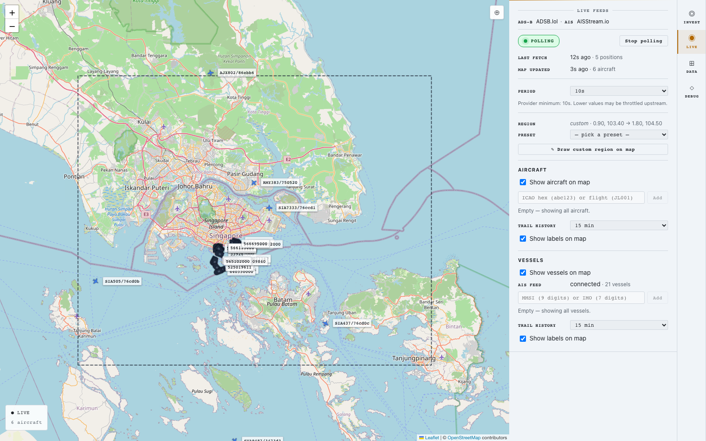
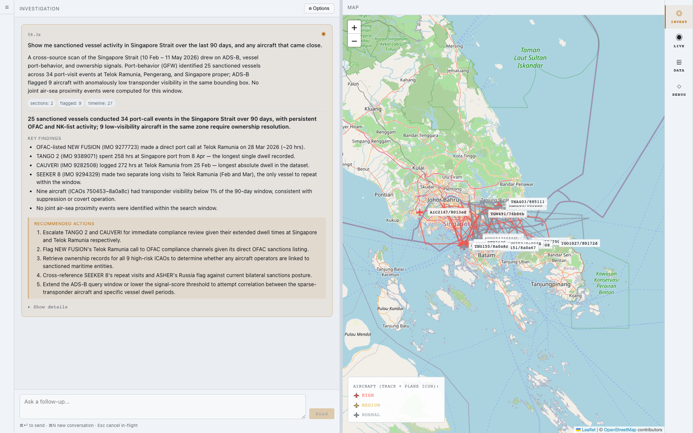

# Reading the map and the report

What every symbol on the map means, and how each section of the report is structured.

---

## The map

The right-hand pane on the **INVEST** tab is a Leaflet map. After a turn finishes, anything geographic from the investigation gets rendered there. This is also the same kind of map you see on the **LIVE** tab, with slightly different symbol rules for live versus historical contexts.

### Aircraft

Aircraft appear as airplane silhouettes oriented in the direction they were heading.

| Marker | Meaning |
|---|---|
| **Red** outlined airplane with a track line | High-risk: the ADS-B specialist flagged this aircraft on one or more anomaly signals. |
| **Amber / yellow** outlined airplane with a track line | Medium-risk: flagged with milder signals or a single rule hit. |
| **Grey / blue** airplane | Normal: present in the bbox + window but no anomalies flagged. |
| **Larger airplane icon** (LIVE mode only) | This aircraft is on your watch list. |

The track line behind each aircraft is its actual flight path during the investigation window — built from successive ADS-B position reports.

### Vessels

Vessels appear as ship silhouettes oriented in the direction they were heading (or last reported course).

| Marker | Meaning |
|---|---|
| **Dark slate** ship icon | Standard rendering — the vessel was observed during the window. |
| **Larger ship icon** (LIVE mode only) | This vessel is on your watch list. |
| **Trail polyline** (LIVE mode only) | The vessel's recent path, built from the last N minutes of AIS positions. Length configurable in the LIVE panel. |

In the historical investigation view, each vessel sits at its most-recent position during the window. Vessel **events** (port visits, loitering, encounters, transponder gaps) are rendered as separate glyphs alongside the vessel position.

### Event glyphs (historical only)

When the report includes vessel events, the map shows one glyph per event at its location.

| Glyph | Event type |
|---|---|
| **Anchor** | A port visit — the vessel arrived at a port, stayed for some time, then departed. |
| **Pause / circle** | Loitering — the vessel held position without anchoring. Sometimes a fishing pattern, sometimes a ship-to-ship transfer signal. |
| **Two-ship intersection** | An encounter — two vessels came very close to each other for a sustained period. |
| **Dashed line / break** | A transponder (AIS) gap — the vessel went dark for a period and came back. |

Click any glyph to see the event details — start time, duration, the event-type-specific metadata (port ID for visits, encountered-vessel ID for encounters, gap duration for gaps).

### Joint correlation lines

When the report includes air-sea joint correlations, the map renders **dashed connector lines** between each paired aircraft and vessel. The line goes from the aircraft's position at the time of the pairing to the vessel's position at the event.

If you see a dashed line, that aircraft was within the configured proximity radius and time window of that vessel's event. The strongest pairing (smallest distance) is usually called out specifically in the report's conclusion.

### Recenter and zoom

- The map auto-fits to the investigation's bbox when results land. If you've panned/zoomed away, click the **⊕** button in the top-right of the map to snap back.
- Mouse wheel to zoom. Click + drag to pan. Same as any Leaflet map.

---

## The report

Every report has the same top-level structure. Some sections only appear when relevant data exists.

### The summary

Two or three sentences at the top, naming the sources used and the headline finding. Read this first — it's the synthesizer's TL;DR.

### Headline + key findings + recommended actions

Below the summary, three structured blocks:

- **Headline** — one sentence the analyst should walk away knowing.
- **Key findings** — short bullets, each a single concrete observation ("GLOBAL DIGNITY in active port visit at 25.38°N", "11 aircraft within 4.74-9.93 nm of the vessel"). 3-6 bullets typical.
- **Recommended actions** — imperative bullets ("Verify X", "Cross-reference Y", "Escalate to Z"). 2-5 bullets typical.

If the system has nothing to recommend, the recommended-actions list will be short or absent — not padded.

### Per-source sections

Below the headline block, one expandable section per specialist that ran. Common ones:

| Section | What's in it |
|---|---|
| **ADS-B** | Per-aircraft findings. Each entry lists the ICAO, callsign, anomalies detected, and a risk level. |
| **Ownership** | Per-aircraft registration and operator data, with any sanctions hits attached. |
| **Vessels** | Per-vessel findings. GFW vessel ID, IMO, flag, recent event summary, ranked anomalies. |
| **Vessel sanctions** | Per-vessel sanctions chain — current listings, past listings, transitions in/out of listed status. |
| **Port behavior** | Aggregate regional scan — top vessels ranked by a signal score (port visits + gaps + sanctioned status). |

Each section header tells you what the source produced. The body is structured: bullets, sub-bullets, sometimes tables. Click the section header to expand or collapse.

If a specialist was dispatched but returned no findings, it gets a section saying so (rather than being silently dropped) — so you always know which sources were consulted.

### Convergence

This section only appears when two or more specialists independently flagged the same entity.

| Field | Meaning |
|---|---|
| Entity | The ICAO (for aircraft) or IMO (for vessels) the sources agreed on. |
| Agreed by | The list of specialists that flagged it. |
| Strongest signal | One sentence describing why it surfaced — usually the most-specific reason from whichever specialist had the strongest finding. |

Convergence is your strongest single signal. When the maritime specialist *and* the sanctions specialist both flag the same vessel, that's substantially more interesting than either flag alone.

### Joint correlations

Only appears for cross-domain queries. Each entry is one paired aircraft and vessel.

| Field | Meaning |
|---|---|
| Aircraft | ICAO + callsign + registration. |
| Vessel | Name + IMO/MMSI + flag. |
| Distance | How close the aircraft was to the vessel, in nautical miles. |
| Time overlap | How long they were both within the proximity radius, in minutes. |
| Event | Which vessel event the aircraft overlapped with (port visit, encounter, etc.). |
| Sample position | The aircraft's altitude and coordinates at the moment of closest approach. |

The conclusion at the bottom of the report calls out the closest pair specifically.

If there were no proximity pairs, the section either doesn't appear or appears with an explicit *"no joint air-sea proximity correlations identified"* note. **The negative case is a real result, not an error.**

### Timeline

A chronological event list pulled from all sources — port visits, encounters, transponder gaps, ownership transitions, sanctions list changes. Each entry shows the time, source, entity, and a short summary.

Useful when the question spans a longer window (24h+) and you want to see "what happened in order" rather than read each source separately.

### Critic review

A short block summarising how the report scored against the critic's checks. Things the critic looks for:

- Are bullets in the per-source sections grounded in the underlying findings (no fabrication)?
- Does the conclusion follow from the evidence?
- If two specialists disagreed about the same entity, is the disagreement surfaced (rather than silently resolved)?
- Are the recommended actions specific and actionable?
- For multi-turn conversations: is the new turn consistent with the prior ones?

If the critic flagged anything, the synthesizer got one revision pass before the report finalised. The critic review section tells you whether that happened and what the residual concerns were.

### Conclusion

One or two sentences at the bottom. If joint correlations exist, the conclusion mentions the strongest pair (with units and event type). If everything came back clean, the conclusion says so plainly.

---

## How to interpret risk levels

The ADS-B specialist (and to some extent the vessels specialist) score each entity on a 3-point scale:

| Level | Meaning |
|---|---|
| **High** | Multiple anomaly signals fired, or a single signal of high specificity (e.g. registered military aircraft on a non-published routing). Worth a human look. |
| **Medium** | One or two milder signals, or signals that often have benign explanations. Context-dependent — could be interesting, could be noise. |
| **Normal / low** | No anomalies flagged. The entity was present in the bbox but didn't trigger any of the scoring rules. |

Risk levels are **per-source**. The same vessel can be rated "low risk" by the maritime specialist (no unusual events in its recent history) and "high risk" by the sanctions specialist (active sanctions listing). When this happens, the convergence + critic-review machinery surfaces the disagreement explicitly — it's not a bug, it's the system showing you that two lenses see the same entity differently.

---

## Drilling into a finding

Several ways to dig deeper from a report:

- **Expand a section.** Click the section header to see all entries.
- **Click an entity on the map.** Brings up its details popup.
- **Ask a follow-up.** *"Tell me more about ICAO 300000."* — much faster than the original turn, because the system reuses what it already knows.
- **Re-run with different options.** Change the joint-correlation radius or altitude limit in the Options panel and re-submit. Useful when you want to test sensitivity ("are these pairings tight, or just within a generous threshold?").

---

## What's next

- [getting-started.md](getting-started.md) — first-time tour.
- [example-queries.md](example-queries.md) — things to ask.
- [how-it-works.md](how-it-works.md) — what happens behind the scenes.
- [live-mode.md](live-mode.md) — real-time monitoring.
